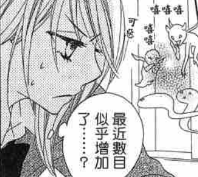
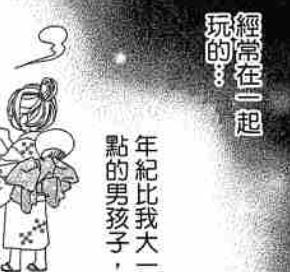

# 故事临摹

当前：临摹脚本-->分镜画面

下一步：临摹脚本-->编剧衔接（添加一些衔接的场景，添补一些对话）-->分镜画面

使用金字塔临摹法

临摹 2900字-->2500-->2000-->1000-->500

默写500-->1000-->2000-->2500-->2900

### 当转化为画面：

- 能改口语则口语化，不要书面语话

- 一些口语化句子：

  - 怎么了, xxx
  - xxx! 你怎么

- 这个世界是哪个只需要一下词语，就可以回复所有的消息：

  - 是啊
  - 确实
  - 真的假的
  - 哈哈
  - 笑死
  - 6
  - 我去

- 加入各种语气词：
  - 嗯？
  - 喔？
  - 唔！
  - 呃。。。
  - 咦？
  - 噫！
  - 啊，啊咧？
- 啊！
  - 啊，
  - 哇！
  - 呜......
  - xxx啦！
  
- 长句通过加逗号拆成短句

- 短句可通过加...这三个省略点拆分成更短句

- 对于旁白或者心理话：

  - 旁白可以适当的前移后移，一整段旁白可以安插在几个场景中，可以安插在几个不同动作后。

  - 一部分可以摘出来作为碎碎念

    

  - 一部分可以弄个思考框包住

    

  - 一部分可以直接打字上去

    

- 在不影响故事的情况下，交给分镜自由发挥吧，比如添加点对话添加点回忆。